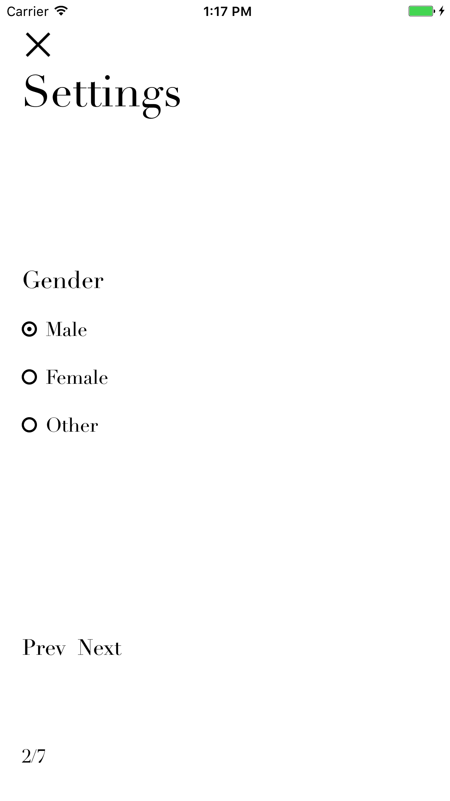

# SlidingForm
SlidingForm generates sliding forms. This lib is written in Swift3.

## Anchors

- [Showcase](#showcase)
- [Usage](#usage)
- [Screenshots](#screen-shots)

## Showcase

You can download the project and try it.


## Usage

1.Customize Configuration (optional)
```
// e.g. change font
override func viewDidAppear(_ animated: Bool) {
    // Customize SlidingForm layout
    SlidingFormPageConfig.sharedInstance.customFontName = "Didot"
}
```

2.Create a sliding form and present it
```
let vc = SlidingFormViewController.vc(
    withFormTitle: "Settings",
    pages: [
        SlidingFormPage.getInput(
            withTitle: NSLocalizedString("Nickname", comment: "SlidingForm"),
            isRequired: true,
            desc: NSLocalizedString("Please enter your nickname.", comment: "SlidingForm"),
            defaultValue: NSLocalizedString("Default Nickname", comment: "SlidingForm"),
            errorMsg: "Cannot be empty!"
        ),
        SlidingFormPage.getRatio(
            withTitle: "Gender",
            options: ["Male", "Female", "Other"]
        ),
        SlidingFormPage.getTextarea(
            withTitle: "Self Description",
            isRequired: true,
            desc: NSLocalizedString("Describe yourself a little bit here.", comment: "SlidingForm"),
            errorMsg: "Cannot be empty!"
        ),
        SlidingFormPage.getSelect(
            withTitle: NSLocalizedString("Year of Birth", comment: "SlidingForm"),
            selectOptions: ["1994", "1993", "1992", "1991", "1990"],
            selectedOptionIndex: 2
        ),
        SlidingFormPage.getInput(
            withTitle: "Four-Digit Code",
            isRequired: true,
            desc: NSLocalizedString("Please enter a four-digit code. Letters and numbers only.", comment: "SlidingForm"),
            textRule: "[A-Za-z0-9]{4}",
            errorMsg: "The length should be 4. Use letters and numbers only."
        ),
        SlidingFormPage.getCheckbox(
            withTitle: "Language Skills",
            options: ["Mandarin", "English", "Japanese", "Franch"],
            optionsDefaultValue: [true, true, false, false],
            selectionMin: 1,
            selectionMax: 4
        ),
        SlidingFormPage.getSwitches(
            withTitle: "Enable Notifications",
            options: ["Local Notification", "Push Notification"],
            optionsDefaultValue: [true, true]
        )
    ],
    cancelCallback: {
        // Callback function when this form is canceled

        self.text.text = "Canceled."
}) { (results) in
    // Callback function when this form is saved

    var resultStr = "Result:\n"
    // Input result: String
    // value (String)
    let nickname = results[0] as! String

    resultStr += "nickname: \(nickname)\n"

    // Radio result: [Any]
    // [indexOfSelectedItem: Int, stringValueOfSelectedItem: String]
    let gender = (results[1] as! [Any])
    let genderIndex = gender[0] as! Int
    let genderStr = gender[1] as! String

    resultStr += "gender: \(genderStr) (index: \(genderIndex))\n"

    // Textarea result: String
    // value (String)
    let selfDesc = results[2] as! String

    resultStr += "selfDesc: \(selfDesc)\n"

    // Select result: [Any]
    // [indexOfSelectedItem: Int, stringValueOfSelectedItem: String]
    let yearOfBirth = results[3] as! [Any]
    let yearOfBirthIndex = yearOfBirth[0] as! Int
    let yearOfBirthStr = yearOfBirth[1] as! String

    resultStr += "yearOfBirth: \(yearOfBirthStr) (index: \(yearOfBirthIndex))\n"

    // Input result: String
    // value (String)
    let code = results[4] as! String

    resultStr += "code: \(code)\n"

    // Checkbox result: [Any]
    // [boolListOfSelectionStatus: [Bool], stringListOfAllOptions: [String]]
    let languages = results[5] as! [Any]
    let languagesBoolList = languages[0] as! [Bool]
    let languagesValueList = languages[1] as! [String]

    resultStr += "language skills:\n"

    for i in 0..<languagesBoolList.count {
        if languagesBoolList[i] {
            resultStr += "\t\(languagesValueList[i]) (index: \(i))\n"
        }
    }

    // Switch result: [Any]
    // [boolListOfSelectionStatus: [Bool], stringListOfAllOptions: [String]]
    let notifications = results[6] as! [Any]
    let notificationsBoolList = notifications[0] as! [Bool]
    let notificationsValueList = notifications[1] as! [String]

    resultStr += "enable notification:\n"

    for i in 0..<notificationsBoolList.count {
        if notificationsBoolList[i] {
            resultStr += "\t\(notificationsValueList[i]) (index: \(i))\n"
        }
    }

    self.text.text = resultStr
}
self.present(vc, animated: true, completion: nil)
```

## Screen Shots

### Input


### Radio


### Text Area


### Select


### Input with Validation


### Checkbox


### Switch


### Result

